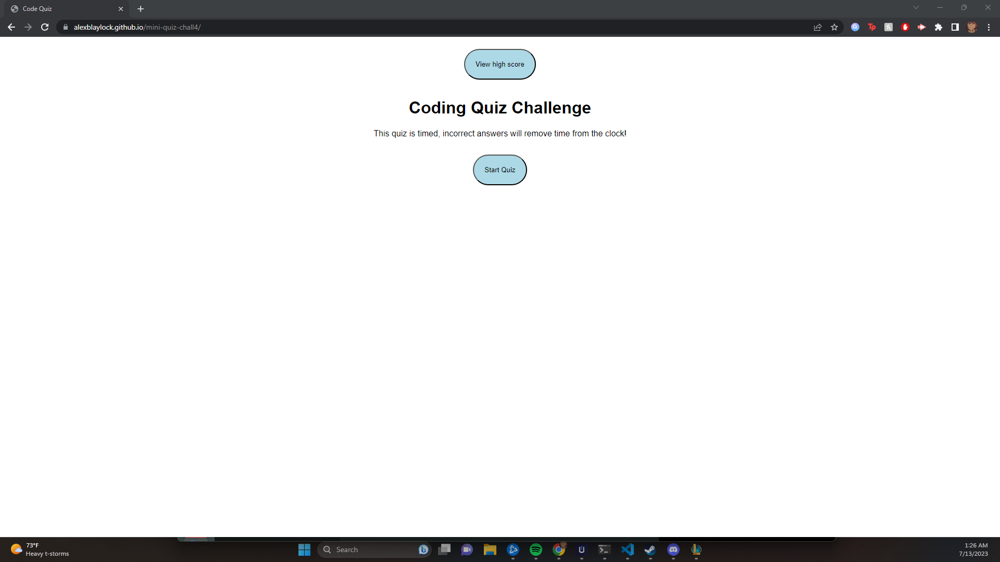
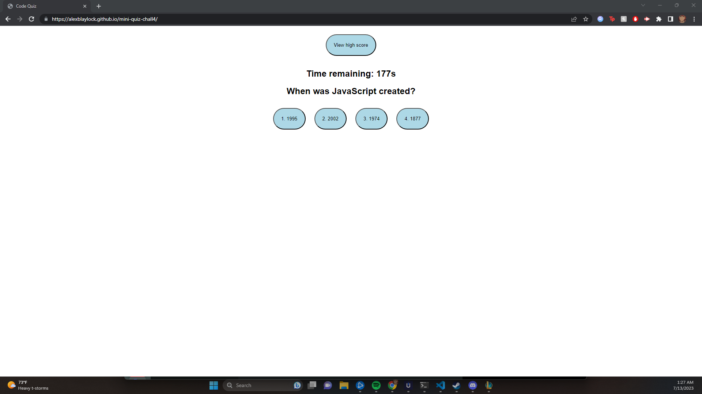

This is a code generator that I created for week 4 of my bootcamp. The purpose of this is to provide a mini-study tool and showcase my knowledge of java script, in particular functions, and local storage/web apis.

This is a project that I had an okay time doing, I searched around and on github I found https://github.com/njthanhtrang/4.-Web-APIs-Challenge-Code-Quiz. After reviewing Jennifer's code, I modeled my project after hers. I changed some variables, added template literals, and commented through out the code to showcase that I have knowledge on this project, and changed her questions to add some of my own work. Overall this project was very straight forward and I found it hard to add a lot more then what was already done.

Again, a majority of the code that I used is from https://github.com/njthanhtrang/4.-Web-APIs-Challenge-Code-Quiz. The variable names, questions, template literals, are original.

Thank you to Jennifer for having fantastic work that gave me a good lead and helped me really understand the project.

UPDATE: 10/23/23 - 

redid almost all of the script.js
added some more styling (not much)

Screenshots:

Link to repo: https://github.com/AlexBlaylock/mini-quiz-chall4
Link to page: https://alexblaylock.github.io/mini-quiz-chall4/

